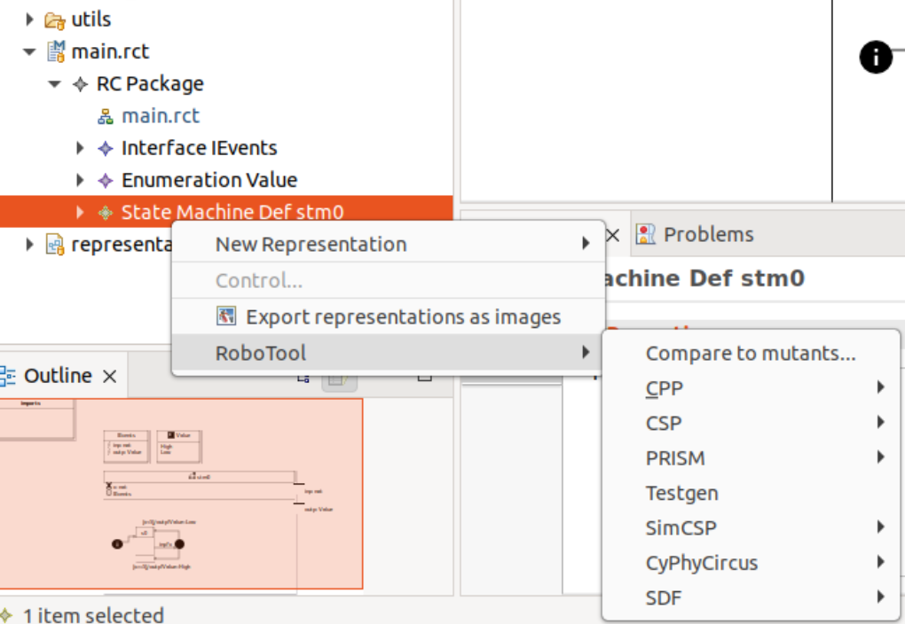
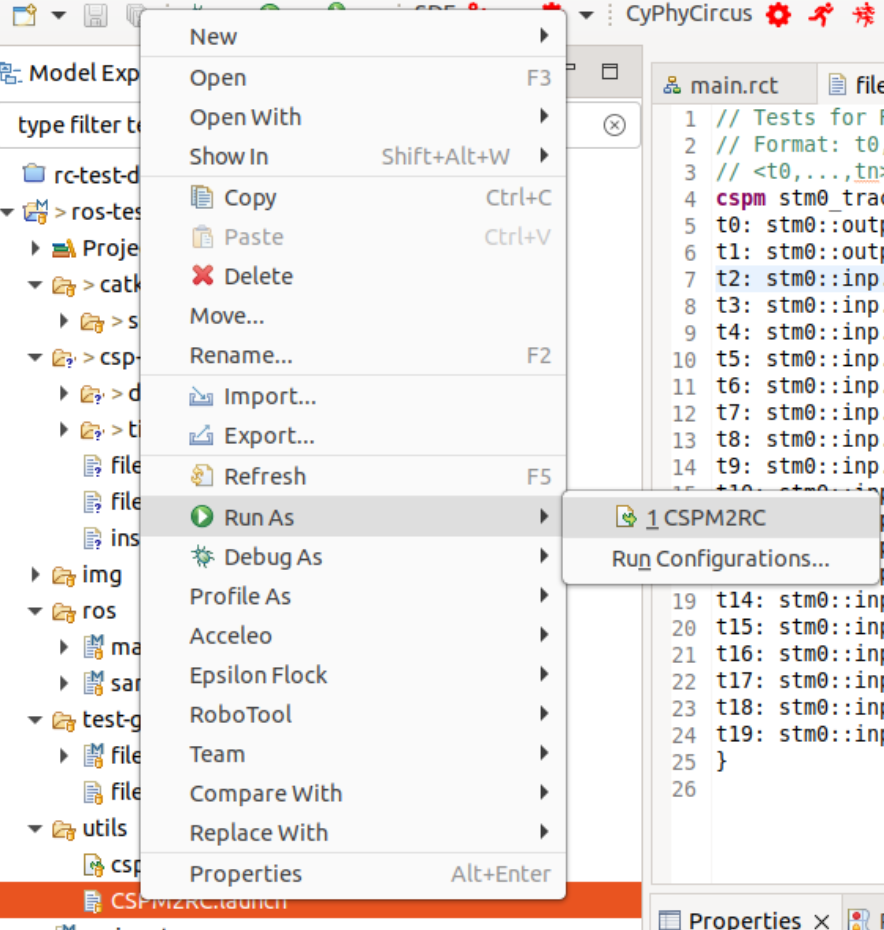

# Sample
This document provides a walk-through for performing model-based testing of a ROS node from a RoboChart component.
It may be useful to first read through the documentation in [robotest-ros-gen](https://github.com/UoY-RoboStar/robotest-ros-gen).

## Requirements
* RoboTool installed using the latest release from the [robotool repository](https://github.com/UoY-RoboStar/robotool/releases/).
  If running under Wayland, start Eclipe from the command line ensuring it is running in X11 mode, to avoid potential incompatibilities, by setting the `GDK_BACKEND` environment variable to `X11`, that is, by using the command `GDK_BACKEND=X11 ./eclipse`. Otherwise, start Eclipse normally. To determine whether you're running under Wayland, you can query the value of the environment variable `XDG_SESSION_TYPE`, for example, by running the command `echo $XDG_SESSION_TYPE` in a terminal.
* FDR4 installed from [https://cocotec.io/fdr/](https://cocotec.io/fdr/). For installation and activation of FDR4 on 
  modern Linux distributions, including Ubuntu, follow the instructions in [the SLEEC-TK repository](https://github.com/UoY-RoboStar/SLEEC-TK?tab=readme-ov-file#fdr4-installation).
* ROS1 (Noetic), for executing the sample node and running the automatically generated tests.

## Starting from a RoboChart model
This repository includes a sample RoboTool project with a sample ROS node for exercising the ROS test generator. We
recommend that you import this Git repository in RoboTool first, by:

1. Copy the URL of this project into your clipboard.
2. Going to `File` > `Import`.
3. Select `Git` > `Project from Git (with smart import)`, then click Next.
4. Select `Clone URI` followed by `Next` twice.
5. Select the inner project `ros-sample` and click `Next` and finally `Finish`.

### Exercise
Inspect the model by opening the graphical representation, if you have not already opened it,
by clicking, for example, on the `main.rct` element under `RCPackage` in the `Model explorer`,
shown on the left.

## Generating forbidden traces
For this task first ensure FDR4 is installed and has it license active. To ensure the license has been activated
open FDR4 on its own and follow the instructions.

To generate forbidden traces:
1. expand the `main.rct` file, in the `Model explorer` shown on the
   left, until the component `State Machine Def stm0` shows up.
2. Right-click on the component, and select RoboTool. You may to
   select it twice in order for the additional options to show up.
3. Select `Testgen`. If everything is working correctly, you'll be
   asked to select how many events to include in the forbidden traces.
4. After the generation has completed, a file of the name `file_main.rtspec`
   will automatically be re-generated under the folder `test-gen`. Note that
   files are overwritten without warning.

### Exercise 1
Inspect the generated forbidden traces and check you understand their correspondence with 
the RoboChart model. In particular consider:

1. Why events carry an `in` or `out` parameter.
2. The correspondence between names in the `rtspec` file and those in the RoboChart model.

If in doubt, you can use `Ctrl` followed by a click on an element of the trace. It will open
the corresponding event in the RoboChart textual representation of the model.

### Exercise 2
Open the file `csp-gen/instantiations.csp` and change the line `core_nat` from the default to
`nametype core_nat = {0..6}'. Re-generate the forbidden traces. 

1. Consider how the forbidden traces have changed and ensure you understand why.
2. Are there values related to the output that are now covered by the list of traces? 
   Consider the definition of `core_nat` that you changed.

## Tranforming traces for input to the ROS test generator
To make the traces in a format suitable for the ROS test generator their syntax needs to be converted.

### Exercise 1
Open the file `test-gen/file_main_target.rtspec`. How do the traces differ from `test-gen/file_main.rtspec`?

### Exercise 2
Transform the traces from one format to the other using a built-in transformation. To do this:

1. Expand the folder `utils` in the `Model explorer`.
2. Right-click on `CSPM2RC.launch` and select `Run as` > `1 CSPM2RC`.
3. Some output will be produced on Console and no exceptions should be thrown.

Inspect the re-generated file in `test-gen/file_main_target.rtspec`. Consider changing the
`core_nat` value, as before, and (1) re-generating the forbidden traces, followed (2) by the
transformation. Ensure you understand the traces.

## Generating tests for ROS
To generate a test driver for ROS, a `rostest` configuration needs to be specified via
one or more files. For this sample, these have already been created in the folder `ros`.

### Exercise 1
Expand the folder `ros` and inspect the file `map.rostest` and `sample.rostest`. The file
`map.rostest` defines a mapping between the ROS node `sample` and the RoboChart component
`stm0`. Inspect both files and use `Ctrl` + click as before to inspect the elements of
the configuration.

### Exercise 2
To trigger generation of the ROS test code, you can make a small change to the file, e.g.
adding white text and saving it. It will automatically regenerate code under the folder 
`catkin_ws/src/ros-gen`. Inspect the automatically generated code. In particular
focus on:

1. The main source file for a test, such as `catkin_ws/src/ros-gen/map/tests/mm_suite/t0/src/main.cpp`.
2. The user-configurable file for the test suite under `catkin_ws/src/ros-gen/map/mm_suite/usr/events.cpp`.
   For this analysis it may be useful to look at the definition of ROS messages under `catkin_ws/src/sample/msg`.

### Exercise 3
Inspect the Python code for the sample node under `catkin_ws/src/sample/src/main.py`.
Consult the [ROS wiki](https://wiki.ros.org/ROS/Tutorials/WritingPublisherSubscriber%28python%29) 
if needed to understand the basic concepts of a publisher/subscriber node.

### Exercise 4
Install ROS (ideally Noetic under Ubuntu 20.04) and configure the `catkin_ws` as the ROS
workspace:

1. Open a terminal in that folder and type (or similar): `source /opt/ros/noetic/setup.bash`,
   followed by `catkin_make`. There should be no errors or warning after running this command.
2. Then type `source devel/setup.bash`.
3. Finally run `rostest map_mm_suite map.test`.

Examine the output results and check which traces fail. Can you understand why they fail
when looking at the `main.py` program? Can you fix the code, bearing in mind the source
RoboChart model? Rerun the tests whenever you make changes to the sample `main.py`.

### Exercise 5
Write a new node or expand the RoboChart model and enrich your implementation to handle
more topics.
